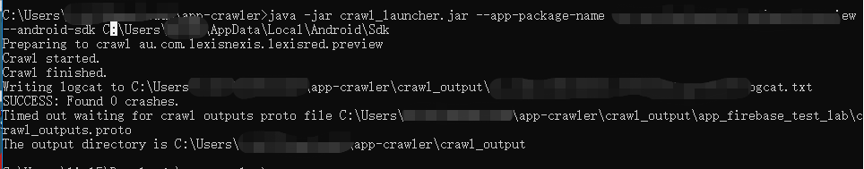

### App Crawler

App Crawler ([Jetpack](https://developer.android.com/jetpack)的一部分)是一个爬虫工具，可以自发的(点击、滑动等)来测试应用，以查找崩溃、视觉问题或性能问题，而不需要编写或维护任何代码。

测试之前确保已经安装最新版本的 Android SDK，来自[Android Studio](https://developer.android.com/studio) 。如果是独立的 Android SDK，确保包含最新的 `build tools`  和 `platform tools` 。

然后下载 [crawler](https://dl.google.com/appcrawler/beta1/app-crawler.zip)，如果被墙了，百度网盘：[传送门](https://pan.baidu.com/s/1mNkL5cpAHsma7IIq-b5cvA )（提取码: 8u2i）

下一步，要么在模拟器上或者真机上运行，确保连接了模拟器或真机：

```powershell
adb devices
```

解压下载的 crawler ，然后打开终端到解压的路径下运行：

```powershell
java -jar crawl_launcher.jar --apk-file path/to/my/app.apk --android-sdk path/to/my/android/sdk

```



`crawler` 参数介绍：

- --android-sdk  **path**      指定Android SDK 的安装路径 `必须` 

- --apk-file **file**    指定 `apk` 文件，如果未指定参数 `--app-package-name`，则 `必须`

- --app-package-name **name**   指定包名，与 `--apk-file` 二者必选其一
- --key-store **path**   指定给应用程序和爬虫apk签名的密钥存储库的路径。当您的应用程序需要特定的签名才能正常运行时，请使用此选项
- --key-store-password **password**  指定密钥（`--key-store`）的密码，如果指定了`--key-store`，则 `必选`。
- --timeout-sec **timeout**   如果未指定时间，默认60s后停止

已知问题：

使用 JDK 9 会出现如下问题，尽量使用JDK 8 or 10+：

> ```
> androidx.test.tools.crawler.launcher.exceptions.ApkSigningException: Failed to delete original signature files
> ```


