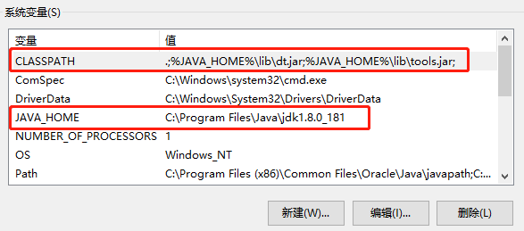
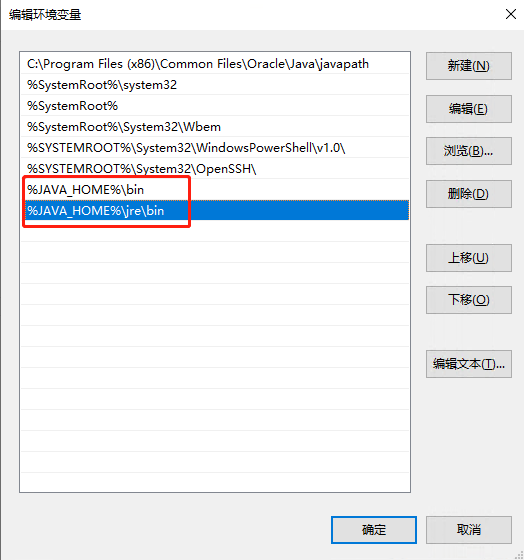
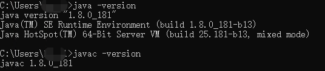
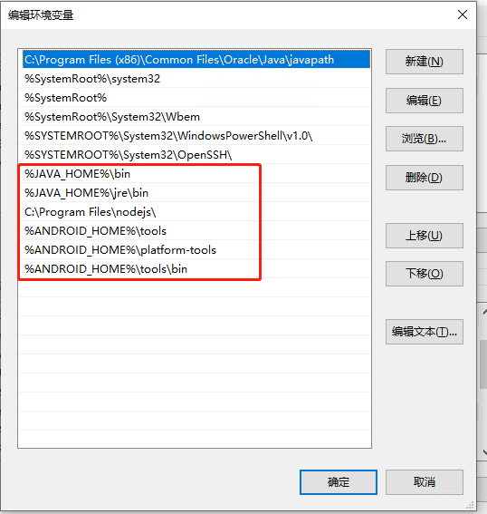
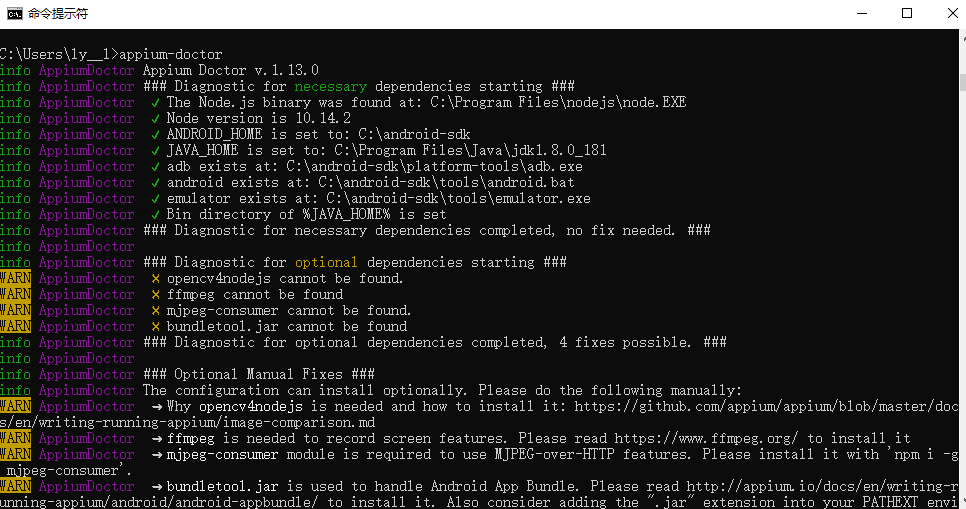
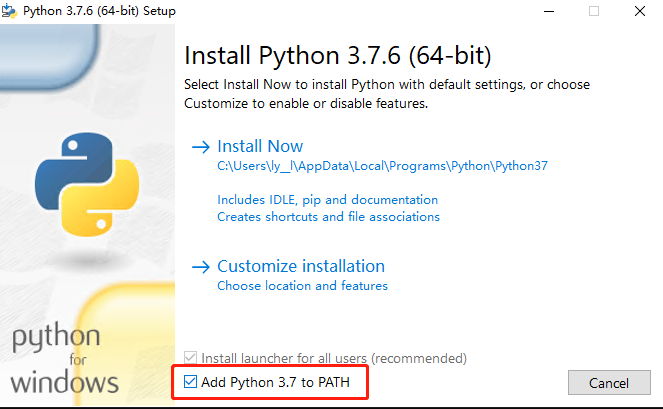

## 							Windows 10 搭建Appium自动化测试环境

### 环境搭建列表

- Java  JDK
- Node
- Android SDK
- Platform-tools
- Build-tools
- Emulator
- Appium
- Appium-doctor

### Ⅰ  安装 Java  JDK

下载 [Java jdk](https://www.oracle.com/technetwork/java/javase/downloads/jdk8-downloads-2133151.html) ，按步骤安装，`Windows 10` 默认安装在路径`C:\Program Files\Java\jdk1.8.0_181`下；安装完成后需要在 `控制面板 => 系统和安全 => 系统 => 高级系统设置 => 环境变量 => 系统变量`中设置3项属性：`JAVA_HOME`、`CLASSPATH`(大小写无所谓)、`Path`、若已存在则点击"编辑"，不存在则点击"新建"。

变量设置参数如下（详情参考：[这里](https://blog.csdn.net/lb245557472/article/details/74625793)）：

- 变量名：`JAVA_HOME`

- 变量值：`C:\Program Files\Java\jdk1.8.0_181`        // 要根据自己的实际路径配置

- 变量名：`CLASSPATH`

- 变量值：`.;%JAVA_HOME%\lib\dt.jar;%JAVA_HOME%\lib\tools.jar;`         //记得前面有个"."

  

- 变量名：`Path`（该变量一般存在，点击编辑添加即可）
- 变量值：`%JAVA_HOME%\bin`   `%JAVA_HOME%\jre\bin`


验证安装是否配置成功，打开命令行工具：

```powershell
java -version
# java version "1.8.0_181"
# Java(TM) SE Runtime Environment (build 1.8.0_181-b13)
# Java HotSpot(TM) 64-Bit Server VM (build 25.181-b13, mixed mode)
javac -version
# javac 1.8.0_181
```



### Ⅱ  安装 Node & NPM

下载 [Node](https://nodejs.org/en/) ，按步骤安装，`Windows 10` 默认安装在路径`C:\Program Files\nodejs\`下，<font color=red>一般来说，安装的时候已经默认添加了环境变量，无需手动添加</font>>；如果未添加，则需要在 `控制面板 => 系统和安全 => 系统 => 高级系统设置 => 环境变量 => 系统变量`中设置环境变量`Path`。

- 变量名：`Path`（该变量一般存在，点击编辑添加`Node`的安装路径即可）
- 变量值：`C:\Program Files\nodejs\`

验证安装是否成功：

```powershell
node -v
# v10.14.2
npm -v
# 6.4.1
```


### Ⅲ  安装 Android  SDK

安装`Android  SDK`环境可以使用直接下载 [Android studio](https://developer.android.com/studio/#downloads)来进行安装，但是会下载好多无用的东西，占用内存，但是无需配置太多设置。

这里介绍下用命令行安装的方法（命令行安装可能会失败，多试几次就好）：

- 选择下载下边的`Command line tools only`， Windows 版 `sdk-tools-windows-4333796.zip`，或者直接网盘下载（链接: [https://pan.baidu.com/s/1lQQR71t75cXucHm6sLlbVg](https://pan.baidu.com/s/1lQQR71t75cXucHm6sLlbVg) 提取码: dub3）
- 在C盘下创建`android-sdk`文件夹（或者你自定义位置）
- 然后解压，将解压后的`tools`文件夹，放到目录`C:\android-sdk`下
- 配置环境变量`ANDROID_HOME`
  - 变量名：`ANDROID_HOME`
  - 变量值：`C:\android-sdk`        // 要根据自己的实际路径配置
  - 变量名：`Path`
  - 变量值：`%ANDROID_HOME%\tools`  `%ANDROID_HOME%\tools\bin`

验证是否安装成功：

```
sdkmanager --update
# [=======================================] 100% Computing updates...
```

> 问题一
>
> 如果遇到： Warning: File C:\Users\ly__l\.android\repositories.cfg could not be loaded.
>
> 则需要在路径C:\Users\ly__l\.android\ 下创建一个空的repositories.cfg文件即可

### Ⅳ  安装 Build-tools 

```powershell
sdkmanager --install "build-tools;29.0.0"
```

### Ⅴ  安装 Platform-tools

-  `sdkmanager` 安装 `platform-tools`（`sdkmanager` 详细命令参考：[这里 ](https://developer.android.com/studio/command-line/sdkmanager)）

  ```powershell
  # 使用sdkmanager 安装
  sdkmanager  --install  "platform-tools" "platforms;android-29"
  ```

- 配置环境变量`Path`

  - 变量名：`Path`
  - 变量值：`%ANDROID_HOME%\platform-tools`

- 验证安装成功：

  ```powershell
  adb version
  # Android Debug Bridge version 1.0.41
  # Version 29.0.5-5949299
  # Installed as C:\android-sdk\platform-tools\adb.exe
  ```

最终`Path`的设置为：




### Ⅵ  安装Appium

Appium（Version 1.15.1）是一个用于本地、混合和移动web应用程序的开源测试自动化框架。它使用WebDriver协议驱动iOS、Android和Windows mobile应用程序。终端安装server版输入：

```powershell
# 安装 server 版
npm install -g appium
```

默认安装最新的版本，如果想安装指定的版本：

```powershell
npm install -g appium@1.7.2
```

卸载 Appium: 

```powershell
npm uninstall -g appium
npm cache clean --force
```

安装桌面版（因为桌面版方便元素定位，<font color=red>可以同时安装两种</font>），[下载](https://github.com/appium/appium-desktop/releases/tag/v1.15.1) 相应的版本进行安装（安装两种方式，方便使用）。

### Ⅶ  安装 Appium-doctor

`Appium-doctor`是一个小型软件，它检查 Appium 成功运行的所有(几乎所有)前提条件。终端输入：

```powershell
npm install -g appium-doctor
```

`appium-doctor` 检查前提条件的输出应该是这样的:



至此Android环境搭建完成了！！！真机可直接运行。
如果需要使用 android 模拟器，则需要第 Ⅷ 步安装模拟器。

### Ⅷ 安装 Emulator

- 首先需要下载镜像文件：

  ```powershell
  # 查看所有可安装的组件
  sdkmanager --list --verbose
  # 更新组件
  sdkmanager --update
  # 安装
  sdkmanager --install "system-images;android-28;google_apis;x86"
  ```

- 然后下载硬件加速器：

  ```powershell
  sdkmanager --install "extras;intel;Hardware_Accelerated_Execution_Manager"
  ```

- 下一步创建模拟器（`avdmanager` 详细介绍参考：[这里](https://developer.android.com/studio/command-line/avdmanager)）：

  ```powershell
  avdmanager create avd -n android-emulator -k "system-images;android-28;google_apis;x86" -b x86 -c 100M -d 7 -f
  ```

- 最后运行模拟器：

  ```powershell
  # android-emulator 为上边创建模拟器的名称（-n android-emulator）
  emulator -avd  android-emulator
  # 或者
  emulator  @android-emulator
  ```

`Tips:`

> 不可以在虚拟机上运行android模拟器，因为virtualBox的组件（Hyper-V or Credential Guard）和模拟器的组件（HAXM）有冲突

> 问题一
> "PANIC: Cannot find AVD system path. Please define ANDROID_SDK_ROOT"
> 检查 android-sdk 目录下是否有至less4个目录： emulator ， platforms ， platform-tools ， system-images
> 缺少哪个安装哪个（如果缺少platforms，则可以创建一个空的文件夹也可以），安装方法：
> sdkmanager --install "emulator" 
> sdkmanager --install "platforms;android-26"
> sdkmanager --install "system-images;android-26;google_apis;x86"
> 参考：[这里](https://androidcookie.com/panicavdpath-android_sdk_root.html)

> 问题二
> "[6100]:ERROR:android/android-emu/android/qt/qt_setup.cpp:28:Qt library not found at ..\emulator\lib64\qt\lib
> Could not launch 'C:\android-sdk\..\emulator\qemu\windows-x86_64\qemu-system-x86_64.exe': No such file or directory "
> 需要使用emulator目录下的emulator启动虚拟设备即可（尝试tools目录下的emulator和emulator目录下的哪个可以用哪个）


### Ⅸ  测试代码 

- 安装`Python`环境，[下载](https://www.python.org/downloads/) 安装

- 安装时勾选`Add Python3.X to Path` 避免手动配置环境变量

  

- 这样安装后运行`python`脚本直接在终端使用：`python  test_android.py` 即可
  运行`test_android.py`脚本（`真机还是模拟器自行切换注释代码！！！` [脚本下载](https://github.com/lucas234/appium-sample/blob/master/samples/python/test_android.py)）：

  ```python
  # coding=utf-8
  import unittest
  from appium import webdriver
  import time
  import os
  
  
  class AndroidSimpleTest(unittest.TestCase):
      def setUp(self):
          calculator_desired_caps = {
                  'platformName': 'Android',
                  'platformVersion': '9.0',
                  # emulator
                  'deviceName': 'emulator-5554',
                  'appPackage': 'com.android.calculator2',
                  'appActivity': 'com.android.calculator2.Calculator'
                  # real device
                  # 'deviceName': '520381b347dd148b',
                  #'appPackage': 'com.sec.android.app.popupcalculator',
                  #'appActivity': 'com.sec.android.app.popupcalculator.Calculator'
              }
          self.driver = webdriver.Remote('http://localhost:4723/wd/hub', calculator_desired_caps)
      
      def tearDown(self):
          self.driver.quit()
      
      def test_calculator(self):
          # 测试本机计算器
          # 代码中的定位元素可能会改变，具体根据实际情况改动
          # real device
          #self.driver.find_element_by_accessibility_id("5").click()
          #self.driver.find_element_by_accessibility_id("Plus").click()
          #self.driver.find_element_by_accessibility_id("6").click()
          #self.driver.find_element_by_accessibility_id("Equal").click()
          #self.assertEqual(self.driver.find_element_by_id("txtCalc").text, "11")
          
          # ************
          # emulator
          self.driver.find_element_by_id("digit_5").click()
          self.driver.find_element_by_accessibility_id("plus").click()
          self.driver.find_element_by_id("digit_6").click()
          self.driver.find_element_by_accessibility_id("equals").click()
          self.assertEqual(self.driver.find_element_by_id("result").text, "11")
      
      @unittest.skip("skip")
      def test_something(self):
          pass
  
  if __name__ == '__main__':
      unittest.main()
  
  ```

`Tips:`

```powershell
# 查看设备名（deviceName）
adb devices 
# 查看模拟器版本号（platformVersion）
adb shell getprop ro.build.version.release
# 查看appPackage、appActivity，运行命令时要确保打开了应用
# 例如：首先打开计算器，然后运行命令即可获取到（以 / 隔开，前边appPackage，后边 appActivity ）
adb shell dumpsys window windows | findstr "Current" 
```

其他`adb`相关命令查看：[这里](https://blog.csdn.net/lb245557472/article/details/84068519)
